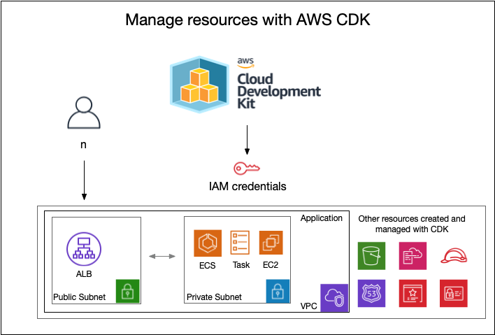

# AWS CDK ECS | Factorial of a non-negative integer!

This is a PHP script running within a Docker container on AWS ECS and calculates factorial of a non-negative integer of a value given by the user.

CDK ( Typescript ) is used to build and manage the entire infrastructure.
The AWS CDK lets you build reliable, scalable, cost-effective applications in the cloud with the considerable expressive power of a programming language.

In the picture below you get a general idea ( doesn't include all services! ) of the infrastructure and services created with the IaC CDK for AWS.

<p align="center">
  
</p>

For a detailed overview of the infrastructure created, you can check this [Cloudfromation visual](app/assets/Cloudformation-visual.png)

The resources are defined within the file [lib/factorial-calc-stack.ts](lib/factorial-calc-stack.ts). The CDK create all the necessary resources.

---

## Prequest

You need the following to run the code:

- [AWS CLI](https://docs.aws.amazon.com/cli/latest/userguide/cli-chap-getting-started.html#install-bundle-other) 
- [Node >= 12](https://nodejs.org/)
- [Docker](https://docs.docker.com/desktop/) 
- [AWS Account](https://aws.amazon.com) (Create an account and add a role with 'AdministratorAccess' role. We will use this to create the resources)
- Code editor (eg. [Visual Studio Code](https://code.visualstudio.com/download))

## Region env setting

Currently the default region is set to ``` eu-west-1 ```. All resources will be deployed to this region!
You can change this within the file [bin/factorial-calc.ts](bin/factorial-calc.ts)

## 1. AWS Authentication

For this exercise, you need to set up your aws cli credentials. For this you need IAM credentials with  'AdministratorAccess'.

If you have a IAM user with AdministratorAccess, you can skip these step: 

1. Go to the AWS IAM console [dashboard](https://console.aws.amazon.com/iamv2/home?#/users) and create a new user.
2. Install AWS CLI with your IAM credentials 
   ```
   $ aws configure
   ```

---

## 2. Install CDK

1. Open a terminal session and run the following command:
   ```
   $ npm install -g aws-cdk
   ``` 

2. Check if the installation succeeded
    ```
    $ cdk --version 
    2.1.0 (build f4f18b1)
    ``` 

---

## 3. Create resources

1. Download this repository or use ```git clone https://github.com/erecica/factorial-calc.git``` 
2. Go to the folder 
   ```
   $ cd factorial-calc
   ```

3. Install the dependencies 
   ```
   $ npm install
   ```

4. The first time you deploy an AWS CDK app into an environment (account/region), you can install a “bootstrap stack”. This stack includes resources that are used in the toolkit’s operation. For example, the stack includes an S3 bucket that is used to store templates and assets during the deployment process.

    You can use the cdk bootstrap command to install the bootstrap stack into an environment:
    ```
    $ cdk bootstrap
    ```

    Result should be something like this:
   
    ```
    Bootstrapping environment aws://999999999999/us-east-1...
    ```
4. Whe this finishes, you are ready to deploy the infrastructure. Use cdk deploy to deploy a CDK app:
   ```
   $ cdk deploy
   ```

5. Confirm!

After a while your app is ready to deploy.

---

## Test the deployment

Once the deployment is finished, you should be able to test it with the following url [https://cdk.recica.tf](https://cdk.recica.tf). 

You should see the following screen: 

<p align="left">
  
</p>

---

## APP

The app calculates the factorial of a non-negative integer, is multiplication of all integers smaller than or equal to n. For example, the factorial of 6 is 6 * 5 * 4 * 3 * 2 * 1 which is 720.
The calculation script is based on [GeegsforGeeks](https://www.geeksforgeeks.org/program-for-factorial-of-a-number/) PHP script.

It runs on a Docker container on ECS infrastructure. It builds on top of this [PHP Nginx Alpine](https://hub.docker.com/r/luzifer/alpine-nginx-php) container. The build is done locally by Docker. The build and deployment is initiated by CDK stack, so you don't need to worry about that.

## Cleanup
To avoid unexpected charges to your account, make sure you clean up your CDK stack.
Run:

  ```
  $ cdk destroy
  ```